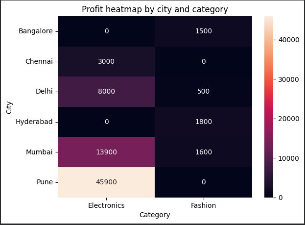
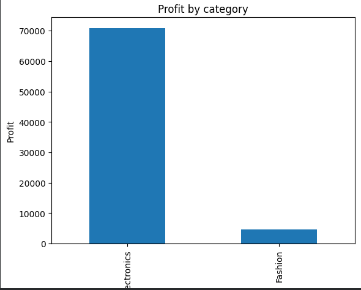
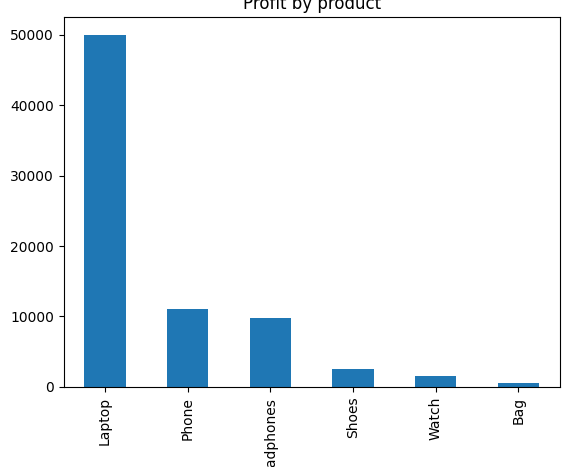
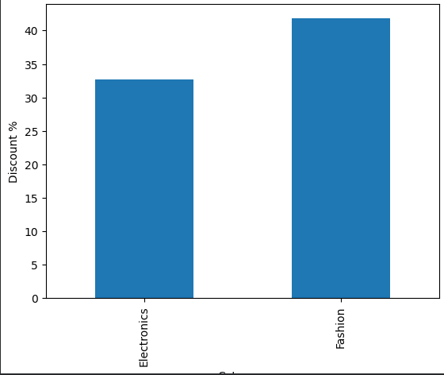

# Advance-E-Commerce-Project
Data Analytics project using Python and Pandas to analyze e-commerce sales performance. Includes profit analysis, customer segmentation, time-based insights, text sentiment extraction, and BI-style visualizations for business decision support.

## 📌 Project Overview
This project analyzes a multi-table e-commerce dataset (Amazon-style) using Python, Pandas, and visualization tools to uncover:
- **Top revenue & profit products**
- **Best performing cities and customer segments**
- **Weekend demand behavior**
- **Delivery/quality issues from customer reviews (text analysis)**
- **Discount-driven margin leakage**
- **BI-style cross-dimensional insights**

## 🧾 Dataset Description
| File            | Description                         |
| --------------- | ----------------------------------- |
| `orders.csv`    | Customer purchase activity          |
| `customers.csv` | Customer demographic & segment data |
| `products.csv`  | Product category, pricing & rating  |
| `reviews.csv`   | Customer feedback text              |

These were merged using `CustomerID`, `ProductID`, and `OrderID.`

## 🛠️ Tech Stack
| Component | Tools                       |
| --------- | --------------------------- |
| Language  | Python                      |
| Libraries | Pandas, Matplotlib, Seaborn |
| Notebook  | Google Colab / Jupyter      |

## 🧹 Data Cleaning & Preparation
Key cleaning operations performed:
- **✔ Removed duplicate orders**
- **✔ Handled missing Age & Rating using median/category mean**
- **✔ Converted date columns → datetime**
- **✔ Standardized review text and removed noise**
- **✔ Converted high-cardinality columns → category type (memory optimization)**

Created new features:
```python
df['ProfitPerItem'] = df['Price'] - df['Cost']
df['Profit'] = (df['Quantity'] * df['ProfitPerItem']) - df['Discount']
df["DiscountPercent"] = (df["Discount"] / df["Price"]) * 100
df["Weekday"] = df["OrderDate"].dt.day_name()
```
## 📊 Core Business Insights
Category & Product Performance:
1. Electronics = 94% of total profit.
2. Laptop is the top profit contributor (₹50,000)
3. Fashion products contribute very little profit

## 👥 Customer Segment Analysis
| Segment   | Profit Contribution |                      Margin % |
| --------- | ------------------: | ----------------------------: |
| **Prime** |  **4× more profit** | Lower margin (high discounts) |
| Regular   |         Less profit |           **Higher margin %** |

## ⏱ Demand Over Time — Weekday Trends
.

- **Weekends → highest profit (Saturday best)**
- **Monday → lowest spending**
- **Schedule promotions on Fri–Sun**

## 📝 Review Text Sentiment Analysis (NLP Lite)
```python
# using fillna() replace NaN with empty string in reviewText feature
df['ReviewText'] = df['ReviewText'].fillna("")

# Identify positive and negative keywords
df['PositiveKeyWords'] = df['ReviewText'].str.contains('excellent|awesome|good|happy', case=False)
df['NegativeKeyWords'] = df['ReviewText'].str.contains('bad|slow|late|average', case=False)
```

| Type              | Count |
| ----------------- | ----: |
| Positive keywords |     4 |
| Negative keywords |     2 |

Issues identified:
- **Delivery delays**
- **Fashion product quality concerns**

## 🔍 Margin Leakage & Pricing Strategy
- **Fashion requires 42% discount on average to sell 😬**
- **Prime customers receive higher discounts (~40%)**
- **Discount hurts profitability**

🔸 Implement data-driven pricing and discount rules**

## 📈 Visualizations Included
### 1.  Heatmap: City × Category Profit
   
   
   
### 2. Profit by Category
   
### 3. Profit by Product
   
### 4. Discount % by Category
   
   
